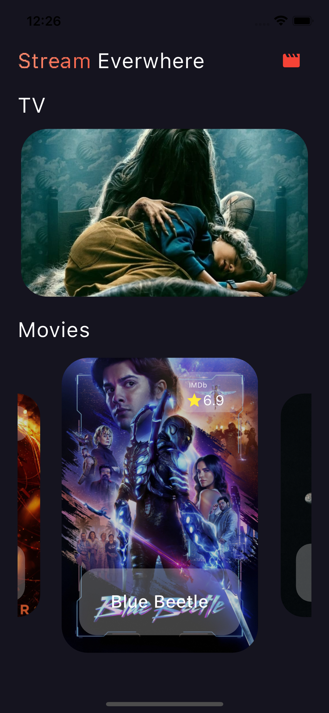
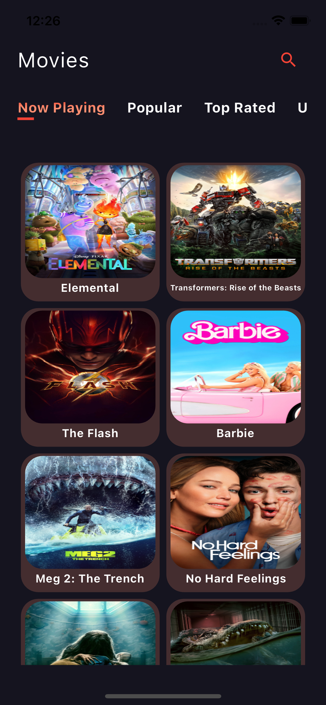
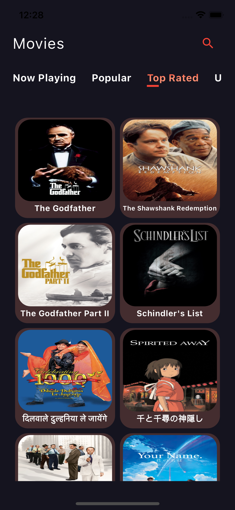
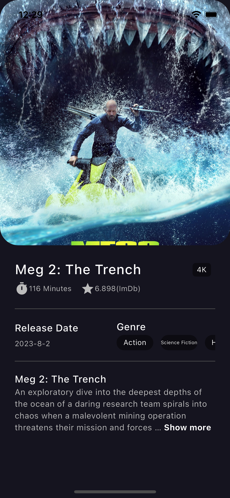
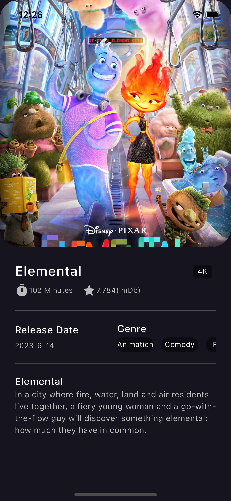
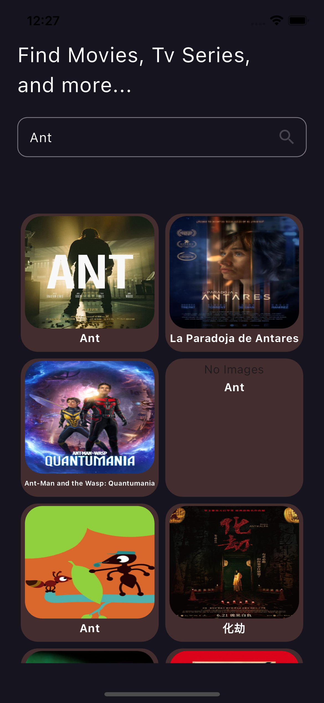
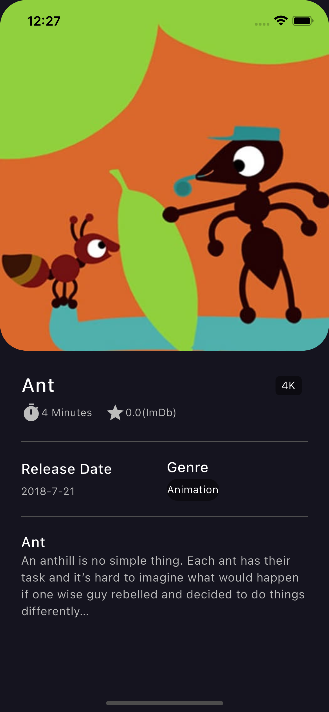
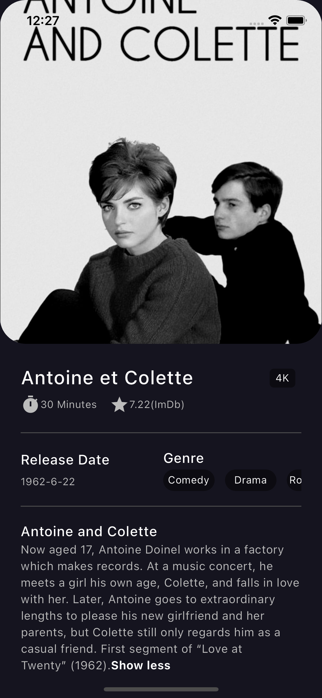
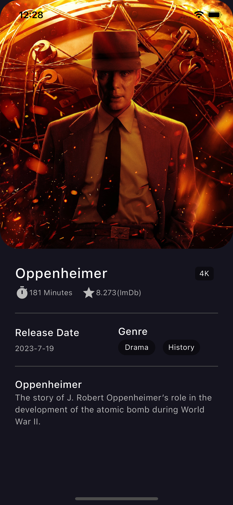

# TMDB App

TMDB(The Movie Database) is where you will find the definitives list of currently available method for movies, tv, actor and image API. 

## To Build
- State Management: BLOC
- HTTPs Request: Dio
- Environment Variables: Flutter_dotenv
- Responsive App: flutter_screenutil
- Error Handling: try-catch blocks, asynchronous error handling,

## ScreenShots:

